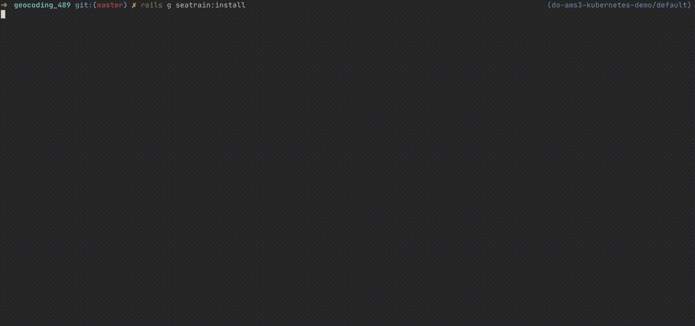

# Seatrain

> Rails + Docker + Digital Ocean Kubernetes + Helm + GitHub Actions = :heart:

**Developer-friendly, GitOps-focused boilerplate generator for containerizing Rails applications. Takes care of both the local development environment _and_ production container orchestration. Relies on GitHub repository as the single source of truth. Caters to standard stack: Rails 5+, Sidekiq, Webpacker, PosgtreSQL, and Redis.**

Seatrain is a collection of _Rails generators_ and tasks that allow you to:

- Set up containerized development environment with Docker Compose and [Dip](https://github.com/bibendi/dip) that also supports system testing with containerized Chrome and VNC. The environment largely borrows from the popular [Ruby on Whales](https://evilmartians.com/chronicles/ruby-on-whales-docker-for-ruby-rails-development) setup by [Vladimir Dementyev](https://github.com/palkan/) from Evil Martians.
- Set up [ingress-nginx](https://kubernetes.github.io/ingress-nginx/) and [cert-manager](https://cert-manager.io) in your cluster for load balancing and SSL. This step will also assign a static IP for your cluster that you can use in DNS records.
- Choose between Digital Ocean Container Registry, Quay.io, Docker Hub, or GitHub Container Registry for storing your images. Other providers can be easily supported by manually editing generated files.
- Generate a Helm chart for deploying Rails charts into the cluster with a single command.
- Generate a GitHub Action for continuous deployment into the cluster on `git push` or PR merge that takes advantage of Docker layer caching for faster deploys.

In the end, the developer experience is not that different from the one provided by Heroku. Merging a PR, or pushing to master will deploy a new release into a production cluster. However, you keep the ultimate control over the whole deployment stack.

Created at [Le Wagon](https://www.lewagon.com), the top-rated coding bootcamp, to power internal and public-facing learning platforms. Partly powered by [Evil Martians OSS](https://evilmartians.com/#oss).

## Table of Contents

- [Installation](#installation)
- [Seatrain configuration](#seatrain-configuration)
- Local development environment with Docker Compose and Dip
- Handling secret values

## Installation

Add this to your `Gemfile`:

```
group :development do
  gem 'seatrain', git: "https://github.com/lewagon/seatrain"
end
```

Then run `bundle install`.

Note that you only need `seatrain` under development group, it does not belong in `test` group or main section of your Gemfile.

#### Disclaimer :star:

This is an _alpha, pre-release_ version of the gem. Anything can change without prior notice, but as the primary purpose of the project is to provide a _sensible default generator for containerized Rails development and production environments_, changes should not affect setups that are already generated.

## Getting started

Run `rails g seatrain:install`.



It creates a file `config/seatrain.yml` that contains settings that further generators and tasks will rely upon. Feel free to modify it by hand, if necessary:

- Add more APT packages that your application runtime might need by adding their names to `with_apt_packages` key.
- Seatrain flow assumes that most of the credentials that you'd like to keep secret will be handled by `rails credentials` mechanism. However, it is not wise to keep **critical credentials**, like a database connection string, inside the application code even if it's encrypted (not everyone on the project with a `master.key` should have direct access to the production database). By default, `seatrain.yml` will assume that `DATABASE_URL` is never commited to git in any shape or form, so you will be prompted for its value interactively upon _manual_ deploy. Upon the CI deploy, a GitHub Action will look for a secret with the same name inside the [encrypted secrets](https://docs.github.com/en/free-pro-team@latest/actions/reference/encrypted-secrets#creating-encrypted-secrets-for-a-repository) set up in the GitHub repository. Read more in "Handling secret values" section.

```yml
# Set versions for Ruby, Postgres, Node, Yarn and Bundler
# They will be used inside development and production containers.
ruby_version: 2.6.6
pg_major_version: 10
node_major_version: 12
yarn_version: 1.22.5
bundler_version: 2.1.4

# Additional apt packages to add into Docker containers (both development and production)
with_apt_packages:
  - vim
  - redis-tools

# Change to false if you are not using Sidekiq or Webpacker with your app.
use_sidekiq: true
use_webpacker: true

# Set the server for your container registry.
# To build and push from local machine you need to make sure you are logged into registry locally (`docker login`)
# When deploying with `rails seatrain:release:deploy` you will be prompted for any missing data
# that is required to create a pull secret inside the cluster.
docker_registry: registry.digitalocean.com
docker_repository: my-docker-repository

# A full name of the production image to be used inside the cluster (e.g., quay.io/account_name/image_name).
# Will be used to push the production image during the deploy.
# Generated Helm configuration will expect this image too.
production_image_name: registry.digitalocean.com/my-docker-repository/my-app

# A name of the Digital Ocean cluster to be used for deployment.
do_cluster_name: my-cluster

# A domain name which will point to your application in production.
# Make sure the DNS A-record points to Digital Ocean's Load Balancer.
# The Load Balancer will be created for you automatically after running `rails g seatrain cluster:prepare`.
# Don't include http(s)://
hostname: my-app.my-domain.com
# An email for Let's Encrypt certificate reminders.
certificate_email: andrey@lewagon.org

# Names of Kubernetes secret values that your Rails and Sidekiq pods will rely on.
# You will be interactively prompted for each value when running `rails seatrain:release:deploy`.
# You will need to set the same names as secrets in your GitHub repository settings to use Github Actions deployment.
# Names should be in UPPER CASE.
required_secrets:
  - DATABASE_URL
```

#### :warning: Known issues

- The possible `.ruby-version` in the root and/or `ruby 'x.x.x'` statement in `Gemfile` (Heroku specific) need to match the Ruby version chosen in the CLI wizard. (https://github.com/lewagon/seatrain/issues/4)
- The `webconsole` will not be displayed by default on Rails error pages in development, as the IP of a Docker host is different from `localhost`. Currently, the way to work around it is to add

```
config.web_console.permissions = ["10.0.0.0/8", "172.16.0.0/12", "192.168.0.0/16"]
```

into the `development.rb`. That could be automated too (https://github.com/lewagon/seatrain/issues/3)

## Generate local development environment

Run `rails g seatrain:docker`. Here's the expected output:

```
🚃 SEATRAIN DOCKER SETUP 🌊
create  .seatrain/Aptfile
create  docker-compose.yml
create  dip.yml
create  .seatrain/Dockerfile.dev
create  .seatrain/Dockerfile.prod
create  .seatrain/.pryrc
create  .seatrain/vnc.sh
insert  config/database.yml
👌 `url: <%= ENV.fetch("DATABASE_URL", " ") %>` injected into config/database.yml

All set, you can run your app in containers locally now! 📦
Run `dip provision` to start
```

## Docker Compose and [Dip](https://github.com/bibendi/dip)

Dip (short for _Docker Interaction Process_) is a Ruby gem from Misha Merkushin at Evil Martians that allows you to interact with development containers as if you were using Rails without Docker at all.

Compare:

```
# No dip 👎
docker-compose run rails rails c # verbose and confusing
```

```
# With dip 👍
dip rails c
```

You can check which commands Dip makes available for you by typing `dip ls`:

```
bash             # Open the Bash shell in rails container
bundle           # Run Bundler commands
yarn             # Run Yarn commands
rails            # Run Rails commands
rails s          # Run Rails server at http://localhost:3000
rails s-altport  # Run Rails server at select port `dip run -p 5000:3000 rails s-altport`
rails logs       # Display last 200 lines of Rails logs and follow
rake             # Run Rake commands
rspec            # Run Rspec commands
sidekiq          # Run commands in sidekiq container
sidekiq logs     # Display last 200 lines of Sidekiq logs and follow
webpacker        # Run commands towards Webpacker service
webpacker logs   # Display last 200 lines of Webpacker logs and follow
psql             # Run Postgres psql console
redis-cli        # Run Redis CLI
```

For the initial setup of local containers, run `dip provision` in your Terminal from the project root.

```
pwd # => my_project_folder
dip provision
# wait 10 minutes while environment is being created
```

This will build images for all the services in generated `docker-compose`, set up volumes (by first removing any pre-existing ones), install Ruby and JS dependencies, and drop-create-migrate development database (inside the dedicated volume).

> :warning: You don't have to run `dip provision` every time you return to the project. Think of this command as "set things up for me initially" or "I give up, nuke my whole environment and create again"

After provisioning the environment, you can use **every command** from your non-Docker workflow by prepending it with `dip`. E.g.:

- `dip webpacker` to run `webpack-dev-server` in a separate Terminal tab to compile your JS assets on the fly.
- `dip rails s` in another Terminal tab to run a Rails server as a separate `docker run` process. The upside of this approach is that you get to use tools like `binding.pry` naturally, without having to `docker attach`. If the `dip webpacker` is not running prior to that — Webpack compilation will happen in the main server thread.
- `dip sidekiq` as yet another Terminal process to process background jobs.
- `dip bundle install` when adding/removing a gem.
- `dip yarn install` when adding another Node dependency.

#### Why not `dip up`?

As `dip` is just a wrapper around `docker-compose`, you can achieve the `docker-compose up -d` style of development by starting all the services defined in `docker-compose.yml` _at the same time_ with `dip up -d`. However, in our opinion this is not the best pratice for heavy local development, as it does not provide easy access to service logs or `binding.pry` debugging.

If, however, you are used to `up` approach, you can start all your services with `dip up -d` and attach to logs by `dip rails logs`, `dip webpacker logs`, or `dip sidekiq logs`. To attach to `binding.pry` you will have to run `docker attach with a name of the running container` (look it up in `docker ps`).

#### :warning: Known issues

- Sprockets needs to be downgraded to 3.7.4 to avoid `sassc` segfault in a Debian container. (https://github.com/lewagon/seatrain/issues/2)
- EventedFileChecker
- poll: true
- Busting caches
- yarn_integrity

## License

The gem is available as open source under the terms of the [MIT License](https://opensource.org/licenses/MIT).
